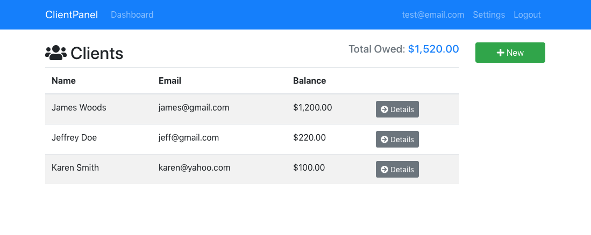
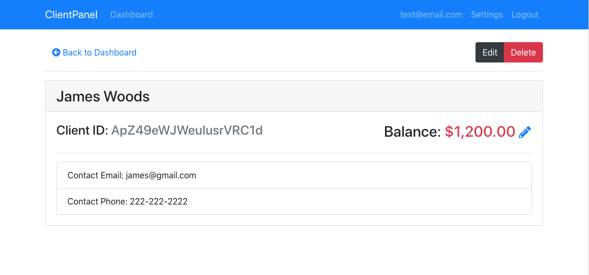
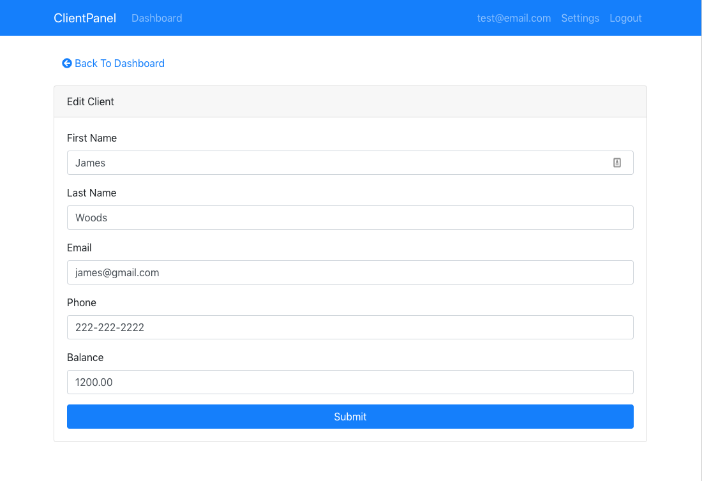
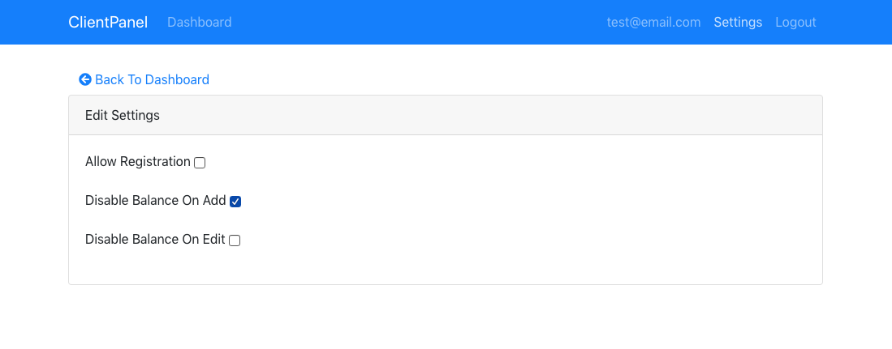

# Client Panel

## React CRUD app integrating Redux and Firebase/Firestore

Demo app for keeping track of clients and remaining balance still owed on their account.  Allows for adding new clients, updating their info, updating balances, deleting client accounts, and some admin settings for the app.

Uses Redux for local state, Firebase for authentication and hosting, and Firestore for client data storage.  Bootstrap for styling.

View [working demo](https://client-panel-redux-nds.firebaseapp.com/)

**Login using**
> test@email.com
>
> 'password'

 

 

 

 

